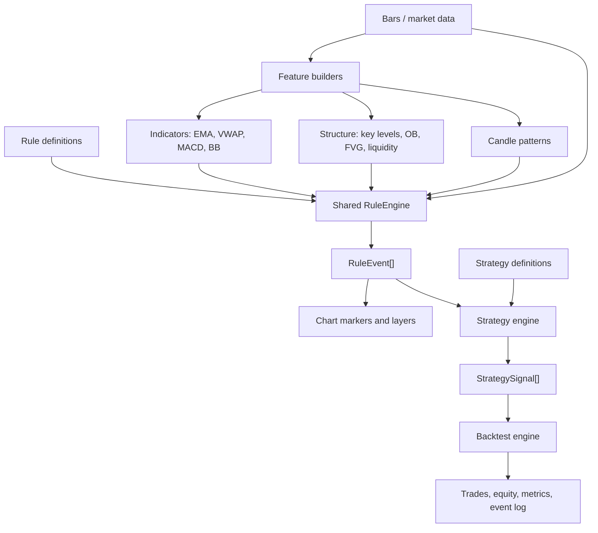

# Rules Engine Refactor

## Vocabulary

- Rule: reusable condition definition, such as price crossing an EMA.
- Rule event: a historical occurrence of a rule on a symbol/timeframe/bar.
- Strategy: composition of rule events into trade intent.
- Signal: a strategy output that can become an order, alert, chart marker, or backtest entry.
- Artifact: persisted chart/object representation of levels, zones, markers, or detector evidence.

Rules are definitions. Events are what happened.

## Target Flow



## Storage

- Built-in JS rule catalog: `src/shared/rules-engine/predefinedRules.js`
- Built-in CJS rule catalog: `src/shared/rules-engine/predefinedRules.cjs`
- Custom JSON rule folder: `src/config/rules/`
- Rule JSON schema: `src/config/schema/rule.json`
- Strategy JSON folder: `src/config/strategies/`
- Existing market artifact files: `data/market_data/<SYMBOL>/chart/<TF>/latest.json`
- Existing trade artifact files: `<trade-dir>/chart/artifacts.json`

## Rule Definition

```json
{
  "id": "price_crosses_ema",
  "abbr": "PX_EMA",
  "name": "Price Crosses EMA",
  "icon": "crosshair",
  "family": "moving_average",
  "params": {
    "side": "above",
    "source": "close",
    "ema_length": 20
  },
  "condition": {
    "crosses_above": [
      { "var": "bar.close" },
      { "var": "indicators.ema_20" }
    ]
  },
  "outputs": {
    "bias": "bullish",
    "marker": "arrow_up"
  }
}
```

## Rule Event

```json
{
  "id": "price_crosses_ema:1717200120",
  "rule_id": "price_crosses_ema",
  "abbr": "PX_EMA",
  "name": "Price Crosses EMA",
  "icon": "crosshair",
  "family": "moving_average",
  "symbol": "EURUSD",
  "tf": "1m",
  "time": 1717200120,
  "bar_index": 2,
  "price": 1.09231,
  "bias": "bullish",
  "confidence": 1,
  "params": {
    "ema_length": 20
  },
  "evidence": {
    "previous": {},
    "current": {},
    "result": true
  },
  "artifact": {
    "type": "marker",
    "icon": "crosshair",
    "label": "PX_EMA"
  }
}
```

## Current Implementation Slice

- `src/shared/rules-engine/ruleEngine.js` and `.cjs` now own expression evaluation.
- `src/shared/rules-engine/features/detectArtifacts.js` and `.cjs` expose artifact detection behind a shared feature boundary.
- Admin chart strategy checks delegate `evaluateRule` to the shared engine.
- API backtests delegate `evaluateRule` to the shared engine.
- Chart strategy hits now include `ruleEvent` for incremental chart adoption.
- The predefined rule registry starts from fresh detector building blocks: crosses, rejections, EMA/VWAP/key level/MACD/candle/structure rules.
- `/api/rules` and `/v2/rules` expose predefined JS rules, custom JSON rules, the rule schema, and an example payload.
- `src/shared/strategy-engine` now composes `RuleEvent[]` into strategy signals with `event`, `and`, `or`, `not`, and ordered `then` logic.
- Backtest event simulation now evaluates chart-emitted `RuleEvent`s through the shared strategy engine and consumes matched `StrategySignal[]` actions for trade execution/event logging.

## Next Refactor Targets

1. Move artifact detector implementation bodies from `src/admin/modules/42trade/chartArtifacts` into `src/shared/rules-engine/features`.
2. Make chart layers render directly from `RuleEvent[]` for detector markers.
3. Replace generated CJS copies with a single build step or source-of-truth package boundary.
