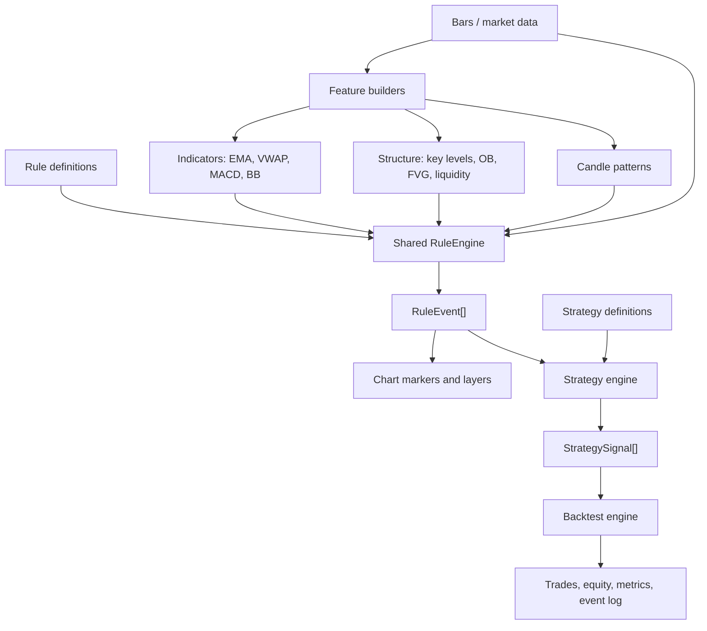

# Rules Engine Refactor

## Vocabulary

- Rule: reusable condition definition, such as price crossing an EMA.
- Rule event: a historical occurrence of a rule on a symbol/timeframe/bar.
- Strategy: composition of rule events into trade intent.
- Signal: a strategy output that can become an order, alert, chart marker, or backtest entry.
- Artifact: persisted chart/object representation of levels, zones, markers, or detector evidence.

Rules are definitions. Events are what happened.

## Target Flow



## Storage

- Built-in JS rule catalog: `src/shared/rules-engine/predefinedRules.js`
- Built-in CJS rule catalog: `src/shared/rules-engine/predefinedRules.cjs`
- Shared module boundary: `src/shared/package.json`
- Shared CJS generator/check: `scripts/build_shared_cjs.cjs`, `pnpm build:shared-cjs`, `pnpm check:shared-cjs`
- Custom JSON rule folder: `src/config/rules/`
- Rule JSON schema: `src/config/schema/rule.json`
- Strategy JSON folder: `src/config/strategies/`
- Existing market artifact files: `data/market_data/<SYMBOL>/chart/<TF>/latest.json`
- Existing trade artifact files: `<trade-dir>/chart/artifacts.json`

## Rule Definition

```json
{
  "id": "price_crosses_ema",
  "abbr": "PX_EMA",
  "name": "Price Crosses EMA",
  "icon": "crosshair",
  "family": "moving_average",
  "params": {
    "side": "above",
    "source": "close",
    "ema_length": 20
  },
  "condition": {
    "crosses_above": [
      { "var": "bar.close" },
      { "var": "indicators.ema_20" }
    ]
  },
  "outputs": {
    "bias": "bullish",
    "marker": "arrow_up"
  }
}
```

## Rule Event

```json
{
  "id": "price_crosses_ema:1717200120",
  "rule_id": "price_crosses_ema",
  "abbr": "PX_EMA",
  "name": "Price Crosses EMA",
  "icon": "crosshair",
  "family": "moving_average",
  "symbol": "EURUSD",
  "tf": "1m",
  "time": 1717200120,
  "bar_index": 2,
  "price": 1.09231,
  "bias": "bullish",
  "confidence": 1,
  "params": {
    "ema_length": 20
  },
  "evidence": {
    "previous": {},
    "current": {},
    "result": true
  },
  "artifact": {
    "type": "marker",
    "icon": "crosshair",
    "label": "PX_EMA"
  }
}
```

## Current Implementation Slice

- `src/shared/rules-engine/ruleEngine.js` and `.cjs` now own expression evaluation.
- `src/shared/rules-engine/features/detectArtifacts.js` and `.cjs` own artifact detection; the old admin detector paths are compatibility wrappers.
- `src/shared/rules-engine/features/strategyEventFunctions.*`, `realtimeAnalysis.*`, and `src/shared/utils/suggestedTradeLevels.*` own strategy-event predicate helpers, realtime analysis, and suggested trade levels; old admin paths are compatibility wrappers.
- `src/shared/utils/chartStrategyChecks.*` owns chart strategy scanning/trade-plan extraction; old admin paths are compatibility wrappers.
- Chart strategy checks delegate `evaluateRule` to the shared engine.
- API backtests delegate `evaluateRule` to the shared engine.
- Chart strategy hits now include `ruleEvent` for incremental chart adoption.
- The predefined rule registry starts from fresh detector building blocks: crosses, rejections, EMA/VWAP/key level/MACD/candle/structure rules.
- `/api/rules` and `/v2/rules` expose predefined JS rules, custom JSON rules, the rule schema, and an example payload.
- `src/shared/strategy-engine` now composes `RuleEvent[]` into strategy signals with `event`, `and`, `or`, `not`, and ordered `then` logic.
- Backtest event simulation now evaluates chart-emitted `RuleEvent`s through the shared strategy engine and consumes matched `StrategySignal[]` actions for trade execution/event logging.
- Chart strategy marker adapters now prefer normalized `RuleEvent` fields for marker identity, label, timeframe, family, type, time, and price.
- Shared `.cjs` files are generated from shared ESM sources via `scripts/build_shared_cjs.cjs`; edit `.js` source files, then run `pnpm build:shared-cjs`.
- The Rules UI loads `/api/rules` for the library and for builder templates, so predefined JS rules and custom JSON rules share one picker.

## Format Review

The current direction is logically sound: keep "rule" for the reusable condition definition and emit "rule events" when that definition happens on a bar. Do not rename rules to events globally; the split is useful because the same rule can happen many times and can be reused by charts, strategies, and backtests.

The main cleanup target is strategy vocabulary. In strategy JSON, `rules[]` currently means executable strategy triggers with actions, while the catalog uses `condition`. This works but is easy to confuse. The preferred long-term shape is:

```json
{
  "engine_version": "42trade.strategy.v3",
  "indicators": [],
  "event_rules": [
    {
      "id": "bullish_bos_context",
      "rule_id": "bullish_break_of_structure",
      "params": { "tf": "current" }
    }
  ],
  "signals": [
    {
      "id": "long_after_sweep_and_choch",
      "name": "Long After Sweep + CHOCH",
      "when": {
        "then": [
          { "event": "bullish_liquidity_sweep" },
          { "event": "bullish_change_of_character", "within_bars": 10 }
        ]
      },
      "actions": [
        {
          "id": "buy",
          "action": "trade",
          "trade_plan": {
            "direction": "buy",
            "type": "market",
            "entry": "bar.close",
            "sl": "suggested_trade_sl(bullish)",
            "tp": "suggested_trade_tp(bullish)"
          }
        }
      ]
    }
  ],
  "risk": {}
}
```

Recommended naming:

- `RuleDefinition`: catalog item with `id`, `abbr`, `name`, `condition`, `icon`, `family`, `params`, and `outputs`.
- `RuleEvent`: runtime occurrence emitted by RuleEngine.
- `StrategySignal`: strategy-level decision produced by StrategyEngine from one or more rule events.
- `Action`: side effect or trade plan attached to a strategy signal.

Recommended storage:

- Keep popular built-ins in `src/shared/rules-engine/predefinedRules.js` because some depend on executable feature helpers and artifact context.
- Keep user-authored/custom portable rules in `src/config/rules/*.json`.
- Let strategies reference catalog rules by `rule_id` where possible; allow inline `when` expressions only for advanced custom signals.
- Version the next breaking strategy shape as `42trade.strategy.v3` instead of silently changing existing v2 files.

Recommended engine improvements:

- Add rule parameter substitution so templates can declare `{ "var": "params.ema" }` and strategies/users can override `ema_length`, source, bias, timeframe, or level.
- Add a capability/dependency block per rule, for example required indicators, required artifacts, and minimum bars, so the chart/backtest can prepare context before evaluation.
- Normalize all rule outputs into event metadata: `bias`, `severity`, `confidence`, `marker`, `price_path`, and optional `zone_path`.
- Keep cross and breakout separate: `crosses_above/below` is a one-bar transition across a value; `breakout` should mean displacement beyond a level/range with confirmation rules such as close beyond, volume, ATR/body expansion, or retest.
- Add a migration adapter from strategy v2 `rules[]/events[]` into v3 `signals[]` before deleting legacy strategy files.

## Future Hardening

1. Add broader API/UI integration coverage for the new shared rule/event/strategy pipeline.
2. Migrate shipped strategy JSON to the proposed v3 signal vocabulary after adding the adapter.
